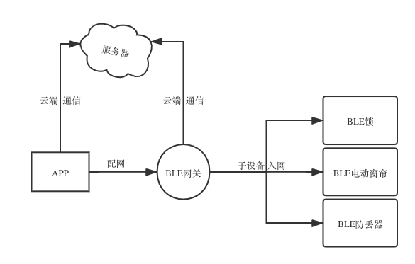

---

---

<h1 id="整体需求">整体需求</h1>

<strong>蓝牙网关</strong>可以同时支持多种不同协议的BLE蓝牙设备（如：BLE锁，BLE电动窗帘，BLE防丢器等）的配网，控制和状态的获取（当设备状态发生改变时，网关可以获取到对应的数据，并将数据上报到服务器）。 

<h1 id="将要对接的蓝牙锁的情况">将要对接的蓝牙锁的情况</h1>
<h5 id="利用芯片：nordic公司的蓝牙芯片">利用芯片：Nordic公司的蓝牙芯片</h5>
<h5 id="设备组成：主锁，子锁，门磁">设备组成：主锁，子锁，门磁</h5>
<h5 id="通信式样：各个部分在配网过程中担当的角色如图（central：蓝牙中心设备，peripheral：蓝牙周边设备）">通信式样：各个部分在配网过程中担当的角色如图（Central：蓝牙中心设备，Peripheral：蓝牙周边设备）</h5>

<h5 id="配网状况描述：（备注：子锁和门磁的配网由美和公司负责。）">配网状况描述：（备注：子锁和门磁的配网由美和公司负责。）</h5>
<ol>
<li>将主锁设置为待配置状态。</li>
<li>手机APP通过BLE的通信Library （startAdvertising）方法，向外广播指定的UUID服务。</li>
<li>主锁扫描到手机APP广播的信息后，对其进行校验，认证通过后，建立通信连接。</li>
</ol>
<h1 id="具体应用场景需求">具体应用场景需求</h1>
<ul>
<li>

针对控制类设备（如：电动窗帘或者锁）： 
1，通过APP可以控制设备和查询设备的状态信息 
2，当子设备的状态被手动改变时，网关要将收到的数据上报到云端。 
3，保证子设备处于休眠状态时，上述两条指令依然可以正常执行。（网关当中是否需要保留关联的子设备信息?）

</li>
<li>

针对上报类设备（如：防丢器等）：当蓝牙网关接收到子设备广播的信息后（或者一定间隔的时候收不到信息），将信息上报到云端，云端通过解析，给指定用APP用户发送推送信息。

</li>
</ul>
<h1 id="目前的疑问点">目前的疑问点</h1>
<ol>
<li>mesh的组网方式，是否能满足上述产品功能需求？</li>
<li>如果不能满足，如何做到多种情况的兼容。</li>
<li>为了满足针对不同设备的通信，除基本预置信息外，其它功能或者服务描述信息（如 UUID等）是否可以放在服务器上，配网时，通过选择的对应产品，网关下载指定的功能描述文件。</li>
<li>当设备和APP在同一个网络环境下，指令是同过局域网WiFi转蓝牙？还是直接通过蓝牙进行通信？</li>
</ol>

